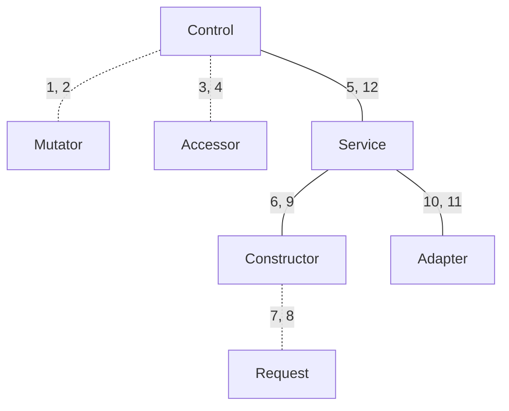

[GWind](readMe.md)


# System
This contains some technical notes.  GWind relies on GCloud for its authentication.
```
$ gcloud --version
Google Cloud SDK 525.0.0
beta 2025.05.30
bq 2.1.17
bundled-python3-unix 3.12.9
core 2025.05.30
gcloud-crc32c 1.0.0
gke-gcloud-auth-plugin 0.5.10
gsutil 5.34
```
This response seems to be untrappable and has been seen when GCloud is not on the path.
```
$ gwind revise projects
gwind: gcloud: readCreateProcessWithExitCode: posix_spawnp: does not exist (No such file or directory)
```


## Source
The source is organised in a modular fashion.  That is, there is a GWind package for each GCP data type that is implemented.  Additionally, there is a Common package, on which the noncommon packages rely.


## Program Flow
For each noncommon package, the dotted lines represent some possible calls; the solid lines represent some definite calls.  The lines' labels indicate the position of a call or reply in the sequence of events: calls first, top down; replies second, bottom up.



## Packages
* [Common](src/GWind/Common)
* [Project](src/GWind/Project)
* [ServiceAccount](src/GWind/ServiceAccount)
* [ServiceAccountKey](src/GWind/ServiceAccountKey)
* [IAMPolicy](src/GWind/IAMPolicy)
* [BillingAccount](src/GWind/BillingAccount)
* [BillingProject](src/GWind/BillingProject)
* [Service](src/GWind/Service)
* [StorageBucket](src/GWind/StorageBucket)


## General Package Structure
Each noncommon package contains a subset of these modules.
* Control: accepts command-line arguments and prints the result of the call.
* Mutator: accepts command-line arguments and returns GCP variables.
* Accessor: accepts GCP lists and returns an appropriate refinement.
* Service: accepts GCP variables and returns a response object, list or code.
* Constructor: accepts GCP variables and returns an appropriate request.
* Adapter: accepts GCP responses and converts them into native data structures.
* Request: defines the native data structure corresponding to a JSON request body.
* Response: defines the native data structure corresponding to a JSON response body
* Domain: provides some type aliases for some standard types.


## The Common Package
* [Presenter](src/GWind/Common/Presenter.hs): ...
* [Preserver](src/GWind/Common/Preserver.hs): ...
* [Auth](src/GWind/Common/Auth.hs): ...
* [Opter](src/GWind/Common/Opter.hs): ...
* [Caller](src/GWind/Common/Caller.hs): ...
* [HTTP](src/GWind/Common/HTTP.hs): ...
* [Mutator](src/GWind/Common/Mutator.hs): ...
* [Transport](src/GWind/Common/Transport.hs): ...
* [Request](src/GWind/Common/Request.hs): ...
* [Domain](src/GWind/Common/Domain.hs): ...


## Testing
...


## Naming
...


## CI/CD
...


## Patterns
When GWind is viewed as a CQRS application:
* the commands are implemented by the create- and delete-commands;
* the queries are implemented by the revise-commands;
* the responsibility is segregated in that each 'pipe' (create, revise, delete) is independent of the others.

Viewed as a hexagonal application, GWind:
* has one port: the Main module that accepts the command-line arguments and routes the program to the relevant control;
* has one type of adapter: the various Adapter modules that accept GCP API responses to convert them into native data structures.


## Needs Improvement
In no particular order,
1. Cache to stop API-bothering
2. Remove dependency on GCloud
3. Handle errors (e.g., revising service account keys when there is no such service account)
4. Rework the tab completion so that, for example, `gwind create service-account The_Project <tab>` gives `gwind create service-account The_Project <service-snake>`
5. Accept both service names and service nicknames for creating and deleting
6. It would be good if, along with the HTTP response code, the commands returned a GCP console URL, linking to the created/deleted object
7. Make the commands idempotent
8. Allow the bucket region to be specified
